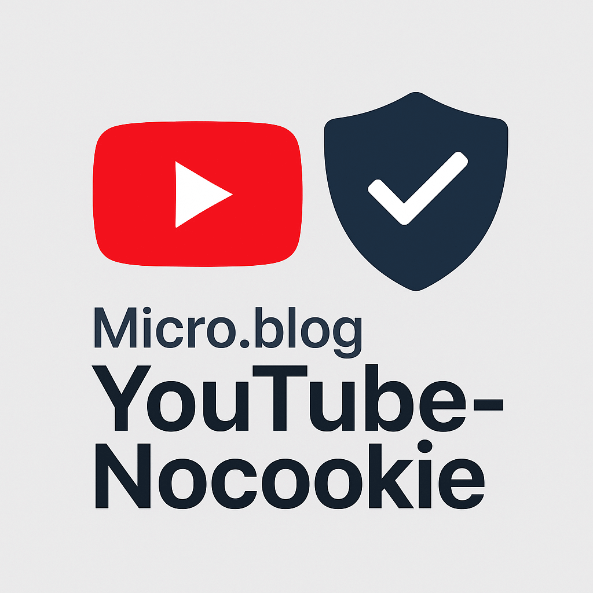

# Privacy friendly Youtube embedds for Micro.blog

This **Micro.blog plugin** renders a thumbnail preview with an overlay and only loads the actual YouTube iframe once the user clicks it. After the click on the thumbail, the video is loaded in the **privacy-enhanced mode** using (`www.youtube-nocookie.com`). This helps reduce tracking and aligns better with privacy regulations like GDPR.

This plugin is forked by [René Fischer](https://fischr.org) from [mbplugin-youtube](https://github.com/fmaida/mbplugin-youtube).

## ✅ Features
- Embeds YouTube videos using `youtube-nocookie.com`
- Videos are **not loaded automatically** (click-to-play behavior)
- Uses **YouTube hq thumbnail preview** (with fallback to /0.jpg if no hq is available)
- Includes a **custom CSS-based YouTube-style play button**
- Optional and customizable **privacy notice as overlay**
- Fully responsive design
- No external JavaScript required

## 📦 Installation
Go to the **Micro.blog plugin directory** and install the plugin from there.

## 📝 Usage
Use the shortcode in your blog posts: ``, for example: ``.
Example page to [see the plugin in action](https://fischr.org/2018/08/26/gardasee-again/).

## ⚙️ Plugin Settings

This plugin offers the following optional settings:
- Custom CSS Class – Adds a custom class to the video container for styling
- Privacy notice on/off – Decide whether you want to show the privacy disclaimer
- Privacy notice text – Allows you to customize the disclaimer text 

All settings can be configured in the Micro.blog plugin settings panel.

## 🙏 Credits

- [fmaida/mbplugin-youtube](https://github.com/fmaida/mbplugin-youtube)
- [shindakun/mbplugin-bandcamp](https://github.com/shindakun/mbplugin-bandcamp)
- [embedresponsively.com](http://embedresponsively.com)
